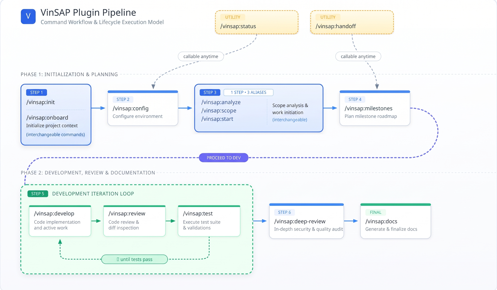

<p align="center">
  
</p>

<h1 align="center">VinSAP</h1>
<p align="center"><b>ABAP / SAP SDLC automation for Vincit — a Claude Code plugin</b></p>

---

VinSAP automates the SAP/ABAP development lifecycle end-to-end inside Claude Code: gathering requirements (Jira tickets, docs, emails, conversations), scoping, milestone planning, ABAP/Fiori development with auto-generated tests, code review, testing, and documentation — with a persistent audit trail so work can be handed off or resumed without losing context.

It talks to your SAP systems through the **Vincit SAP MCP** (a VS Code extension, connected per system) and to Jira/Confluence through **[mcp-atlassian](https://github.com/sooperset/mcp-atlassian)** (run via `uvx`). A shipped hook (`hooks/guard_sap_mcp.py`) mechanically enforces system-mode rules (dev/quality/production) and SQL guardrails on every SAP call — independent of what the model decides to do.

## Contents

- [Prerequisites](#prerequisites)
- [Installing](#installing)
- [Onboarding](#onboarding-first-run)
- [The pipeline, at a glance](#the-pipeline-at-a-glance)
- [Commands](#commands)
- [System modes and guardrails](#system-modes-and-guardrails)
- [Project layout](#project-layout-created-by-vinsaponboard)
- [Configuration reference](#configuration-reference-sdlcconfigjson)

## Prerequisites

| Tool | Why | Learn more |
|---|---|---|
| [Claude Code CLI](https://docs.claude.com/claude-code) | Runs the plugin | [Quickstart](https://docs.claude.com/en/docs/claude-code/quickstart) · [Full docs](https://docs.claude.com/en/docs/claude-code/overview) |
| Node.js ≥ 18 | Playwright, doc tooling | [Getting started with Node.js](https://nodejs.org/en/learn/getting-started/introduction-to-nodejs) |
| Git CLI *(only if `git.enabled` is on)* | Tracks `inputs/`, `outputs/`, `.sdlc/` in version control. macOS: `brew install git` · Windows: [git-scm.com](https://git-scm.com/download/win) (or `winget install --id Git.Git`) | [Pro Git book](https://git-scm.com/book/en/v2) (free) · [GitHub's git basics](https://docs.github.com/en/get-started/using-git/about-git) |
| GitHub CLI (`gh`) *(optional)* | Handy for PRs/issues alongside plain `git`, if this repo lives on GitHub. macOS: `brew install gh` · Windows: [cli.github.com](https://cli.github.com) or `winget install --id GitHub.cli` | [`gh` manual](https://cli.github.com/manual) |
| [Playwright](https://playwright.dev/docs/intro) | Fiori/UI5 e2e test generation — `npm install -D playwright && npx playwright install` (same command on Windows and macOS) | [Writing tests](https://playwright.dev/docs/writing-tests) · [Codegen](https://playwright.dev/docs/codegen) |
| Python 3 | Runs the SAP MCP guardrail hook | |
| draw.io (desktop app + CLI) | Architecture/process diagrams — default `diagram_tool`. macOS: `brew install --cask drawio` (or [drawio.com](https://www.drawio.com/)) · Windows: [installer from GitHub releases](https://github.com/jgraph/drawio-desktop/releases) | |
| Vincit SAP MCP (VS Code extension) | Per-system SAP access — connect this **before** `/vinsap:config` | |
| `uv`/`uvx` | Launches the `mcp-atlassian` connector. macOS: `brew install uv` · Windows: [docs.astral.sh/uv](https://docs.astral.sh/uv/getting-started/installation/) | [uv docs](https://docs.astral.sh/uv/) |
| [mcp-atlassian](https://github.com/sooperset/mcp-atlassian) | Jira/Confluence connector, already declared in `.mcp.json` (launched via `uvx`). Non-secret settings come from `/vinsap:config`; **API tokens are set as environment variables, never stored in any config file** | [Claude Code MCP docs](https://code.claude.com/docs/en/mcp) |
| antigravity CLI *(optional)* | Only needed if configured as the diagram/image-generation tool instead of draw.io/mermaid | |

`/vinsap:onboard` (alias `/vinsap:init`) checks these and offers install guidance for anything missing.

## Installing

```
/plugin marketplace add phanikumarvankadari-code/vinsap-sap-coding-plugin-for-claude
/plugin install vinsap
```

You'll be asked to pick an install scope:

| Scope | Significance |
|---|---|
| **User** | Available in every project you open, just for you. |
| **Project** | Installed for everyone who works in this repo. |
| **Local** (this repo only) | Just you, and only inside this one repo. |

## Onboarding, first run

```
/vinsap:onboard          # or /vinsap:init — same thing
/vinsap:config           # connectors, system modes, deployment mode, review model tiers
/vinsap:analyze          # or /vinsap:scope, /vinsap:start
/vinsap:milestones
/vinsap:develop  → /vinsap:review → /vinsap:test    (repeat per milestone until green)
/vinsap:deep-review
/vinsap:docs
```

`/vinsap:status` and `/vinsap:handoff` work at any point in this sequence, not just at the end.

## The pipeline, at a glance



`/vinsap:test` failures loop internally (auto-fix + re-test) up to a retry cap before flagging the milestone back to `/vinsap:develop` for the user to weigh in — `/vinsap:status` and `/vinsap:handoff` are callable at any point, not just at the phase boundaries shown.

## Commands

<details>
<summary><b>/vinsap:onboard</b> <sub>(alias <code>/vinsap:init</code>)</sub> — choose input source, set up <code>inputs/</code></summary>

Checks prerequisites and offers install guidance. Asks whether inputs come from a **Jira ticket** (pulled via `mcp-atlassian` into `inputs/jira/`) or a **manual drop** into `inputs/docs/`, `inputs/emails/`, `inputs/conversations/`. Creates the folder structure if it doesn't exist yet, then runs a short walkthrough pointing you to `/vinsap:config` next.

</details>

<details>
<summary><b>/vinsap:config</b> — connectors, system modes, deployment mode, preferences</summary>

Creates/updates `.sdlc/config.json`:

- **Connectors** — `mcp-atlassian` (just Jira/Confluence username — everything else, including site URLs, project/space filters, and read-only mode, is hardcoded Vincit-wide in `.mcp.json`). API tokens are set as environment variables, never stored in config.
- **SAP systems** — discovers currently-connected `vincit-abap-mcp-*` servers and asks you to map each to a role (`DEV`/`QA`/`PRD`/custom) and a **mode** (`dev`/`quality`/`production`). Server names are never hardcoded — they're connected globally per system, outside the plugin.
- **Deployment mode** — `mcp` (push/activate/transport directly) or `manual` (generate code + an instruction sheet for you to apply via ADT)
- **Products/modules** — solution-area codes in scope (`FIN`, `SLS`, `SRC`, `MFG`, `SCM`, `HCM`, `AST`, `SVC`, `CORE`)
- **Diagram tool** — default `draw.io`, mermaid as a lightweight fallback
- **Review model tiers** — cheap/fast model for `/vinsap:review`, a smarter model for `/vinsap:deep-review`
- **Screenshot mode** — `auto` (Playwright captures in the background) or `manual` (you supply screenshots)
- **Handoff destination default** — Confluence, Jira comment, or file (always confirmable/overridable at runtime)
- **Git usage** — whether every `.sdlc/timeline.jsonl` entry also gets a matching git commit, 1:1 (off by default, requires the Git CLI if enabled)

</details>

<details>
<summary><b>/vinsap:analyze</b> <sub>(aliases <code>/vinsap:scope</code>, <code>/vinsap:start</code>)</sub> — read inputs, ask gaps, finalize scope</summary>

Reads everything under `inputs/`, produces a consolidated analysis summary (what's known, what's requested, any conflicts across sources), lists open questions, and asks you those questions directly. Writes the finalized scope to `outputs/scope.md`.

</details>

<details>
<summary><b>/vinsap:milestones</b> — break scope into milestones, tagged ABAP/Fiori/mixed</summary>

Queries the target SAP system for reusable objects before proposing new ones. Breaks the scope into discrete, independently testable milestones, each tagged `abap`, `fiori`, or `mixed`. Prefers smaller milestones mapping to a single class/app/capability. Writes the plan into `.sdlc/state.json`.

</details>

<details>
<summary><b>/vinsap:develop</b> — generate code + tests for the next milestone</summary>

Routes to `abap-developer` (ABAP path) or `fiori-developer` (Fiori/UI5 path) based on the milestone's tag.

- **ABAP** — class-based (preferred over reports/includes), Clean ABAP style, `ZMASTER` package hierarchy, hard guardrails, transport handling (`[AI-VSP] <MODULE> | <TICKET_ID> | <desc>` naming, stage in `$TMP`, never releases), auto-generated ABAP Unit tests.
- **Fiori/UI5** — thin controllers, extracted testable logic, auto-generated QUnit (unit) and Playwright (e2e) tests.

Honors `sap.deployment_mode`: `mcp` pushes directly; `manual` writes code + an instruction sheet to `outputs/develop/<milestone>/` for you to apply via ADT.

</details>

<details>
<summary><b>/vinsap:review</b> — quick guideline check, background subagent, cheap model</summary>

Dispatches a subagent (model from `review.quick_model`) to check the milestone's code against the ABAP/Fiori standards — fire-and-forget, doesn't block the session. Findings go to chat and `outputs/reviews/<milestone>-review.md`.

</details>

<details>
<summary><b>/vinsap:test</b> — run tests, auto-fix failures</summary>

Runs ABAP Unit and QUnit tests; Playwright e2e tests run as a background subagent. On failure, analyzes the trace, attempts a fix, re-runs — up to a retry cap — before flagging the milestone as blocked and asking you. Never weakens an assertion to force a pass.

</details>

<details>
<summary><b>/vinsap:deep-review</b> — thorough, cross-milestone, foreground, smarter model</summary>

Runs in the foreground (model from `review.deep_model`) so it can ask you clarifying questions directly if it hits a gap. Checks cross-milestone consistency, package/layer-dependency compliance, security (including any guardrail bypasses taken), and performance. This is the gate before documentation.

</details>

<details>
<summary><b>/vinsap:docs</b> — interactive Functional/Technical/Test documents</summary>

Asks which document to create, lets you pick sections, loads the matching Vincit `.docx` template, and fills it conversationally — pulling what it can from scope/code/tests, asking you for the rest. Follows a plain-English, bullet-first writing style, generates diagrams via the `illustrator` skill, and flags the draft for UX review before saving. Can publish to Confluence (new page or update existing) with the document attached. Test-doc screenshots follow `documentation.screenshot_mode`.

</details>

<details>
<summary><b>/vinsap:status</b> — plain CLI progress view, callable anytime</summary>

Reads `.sdlc/state.json` and prints a kanban-style view of stage and per-milestone progress — no external tooling, just formatted text.

</details>

<details>
<summary><b>/vinsap:handoff</b> — session timeline → markdown summary, callable anytime</summary>

Reads the full `.sdlc/timeline.jsonl` (every meaningful action any skill has taken) and formats a narrative markdown summary: what happened, key decisions, code changes, current status, open items. Asks where it should go — a Jira ticket comment, a standalone file in `outputs/handoff/`, or Confluence — always confirming rather than assuming.

</details>

## System modes and guardrails

Every Vincit SAP MCP server enforces a mode **server-side**, and VinSAP mirrors it — both in skill instructions and, mechanically, in a `PreToolUse` hook (`hooks/guard_sap_mcp.py`) that blocks disallowed calls before they reach the server:

| Mode | Allowed |
|---|---|
| `dev` | Full: create, update, read, run. SQL guardrails still enforced (no mutation, row cap, no unindexed heavy-table scans). |
| `quality` | View, compare, run tests. **No code creation.** Writes only reach quality via transport promotion. |
| `production` | **Read-only code inspection only.** No run, no write, no data access — ever, no bypass. |

Additional hard guardrails baked into `abap-developer` (see `skills/abap-developer/references/`):

- No DB mutations without an explicit user bypass
- No unindexed scans on heavy tables (`BSEG`, `BKPF`, `ACDOCA`, `MARA`, …)
- Row cap (`UP TO 100 ROWS`) on selections
- Syntax check + ATC check before any save/activate
- No release-transport tool is exposed by the MCP server at all — release happens outside the plugin

## Project layout, created by `/vinsap:onboard`

```
your-project/
  inputs/
    docs/ emails/ conversations/ jira/
  outputs/
    scope.md
    reviews/<milestone>-review.md, <milestone>-deep-review.md
    docs/                      # generated Functional/Technical/Test documents
    handoff/
  .sdlc/
    config.json                # connectors, systems/modes, model tiers, screenshot mode
    state.json                 # current stage + per-milestone status — powers /vinsap:status
    timeline.jsonl              # append-only history — powers /vinsap:handoff
```

## Configuration reference (`.sdlc/config.json`)

Only non-secret settings live here. `JIRA_URL`, `JIRA_PROJECTS_FILTER`, `CONFLUENCE_URL`, `CONFLUENCE_SPACES_FILTER`, and `READ_ONLY_MODE` are Vincit-wide constants hardcoded directly in `.mcp.json` (not per-project — note `READ_ONLY_MODE` defaults to `false`, i.e. write access is on by default). `JIRA_API_TOKEN` and `CONFLUENCE_API_TOKEN` are set as real environment variables on your machine and referenced by `.mcp.json` as `${VAR}` placeholders — never written to this file or committed anywhere.

```json
{
  "connectors": {
    "mcp-atlassian": {
      "jira_username": "",
      "confluence_username": ""
    }
  },
  "sap": {
    "systems": {
      "DEV": { "mcp_server": "vincit-abap-mcp-S4H", "mode": "dev" }
    },
    "default_package": "$TMP",
    "deployment_mode": "mcp"
  },
  "products": ["FIN", "SLS", "SRC", "MFG", "SCM", "HCM", "AST", "SVC", "CORE"],
  "diagram_tool": "drawio",
  "review": { "quick_model": "haiku", "deep_model": "opus" },
  "documentation": { "screenshot_mode": "auto" },
  "handoff": { "destination": "file" },
  "git": { "enabled": false }
}
```

---

<p align="center"><sub>Vincit — internal tooling.</sub></p>
