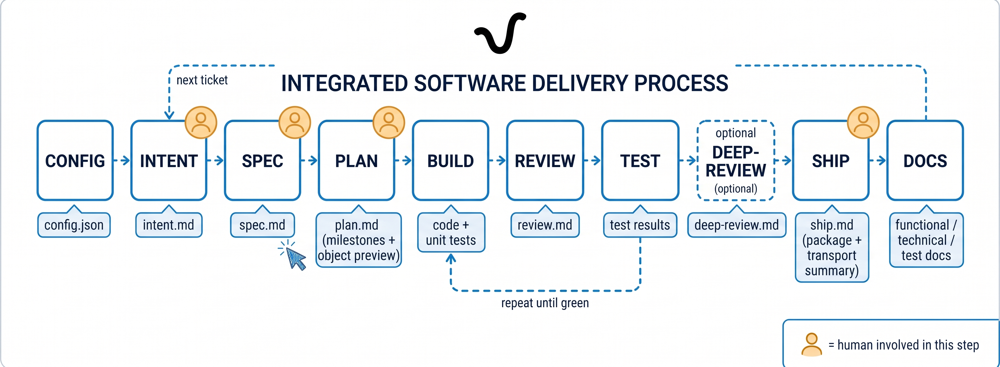
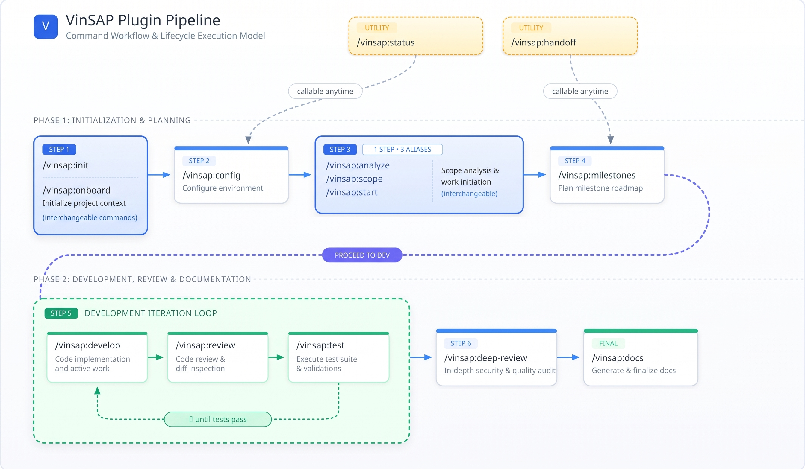

<p align="center">
  
</p>

# Getting Started with VinSAP

*A combined walkthrough — VS Code setup, the Vincit SAP MCP extension, and the VinSAP Claude Code plugin — in the order you actually need them. Draft: proofread this before publishing it to Confluence.*

---

## 1. Install VS Code

Download and install VS Code: https://code.visualstudio.com/download?_exp_download=d53503e735

---

## 2. Install VS Code extensions

From the Extensions view (`Cmd+Shift+X` / `Ctrl+Shift+X`), install:

- **Claude Code** — the AI coding assistant this whole workflow runs inside of
- **markdownlint** — catches formatting issues in the markdown VinSAP generates/reads (specs, plans, docs)
- **ABAP Development Tools (ADT)** *(optional)* — from SAP, for manually browsing/editing ABAP code in VS Code. Not required for VinSAP itself (the Vincit SAP MCP extension below is a separate thing — it's for AI tools, not manual editing), but useful if you also want to inspect objects by hand.
- **SAP Fiori tools** — extension pack from SAP for Fiori/UI5 app development
- Other SAP SE extensions as your project needs (check the VS Code Marketplace, publisher "SAP SE")

---

## 3. Open the VS Code terminal — install Node.js, Claude Code CLI, Git CLI

Open a terminal in VS Code (`` Ctrl+` ``) and run the commands for your OS.

**Note**: keep these commands handy even after setup — if something goes wrong installing the Vincit SAP MCP extension later, re-running the verify commands below (`node -v`, `claude --version`, `git --version`) is the first troubleshooting step.

### macOS

```bash
# Node.js
brew install node
node -v
npm -v

# Claude Code CLI
npm install -g @anthropic-ai/claude-code
claude --version

# Git CLI
brew install git
git --version
```

### Windows (PowerShell)

```powershell
# Node.js
winget install OpenJS.NodeJS.LTS
node -v
npm -v

# Claude Code CLI
npm install -g @anthropic-ai/claude-code
claude --version

# Git CLI
winget install --id Git.Git
git --version
```

### Windows (Command Prompt)

```cmd
:: Node.js — download and run the LTS installer from nodejs.org, then verify in a new window:
node -v
npm -v

:: Claude Code CLI
npm install -g @anthropic-ai/claude-code
claude --version

:: Git CLI — download the installer from git-scm.com, or:
winget install --id Git.Git
git --version
```

---

## 4. Install the Vincit SAP MCP extension

### What this is

- This extension is an **MCP server**. It lets AI tools (Claude Code, Codex, etc.) read and work with ABAP code.
- It is **not** for browsing or editing ABAP code by hand.
- To view or manage ABAP code in VS Code yourself, use SAP's **ABAP Development Tools (ADT)** extension (installed in step 2) — a separate tool for manual changes. [Learn more](https://help.sap.com/docs/abap-cloud/abap-development-tools-for-visual-studio-code/abap-development-tools-for-visual-studio-code?locale=en-US).

### What you need

- VS Code installed (step 1)
- The `.vsix` file for your system

`[SCREENSHOT: Mac — the .vsix file picker/download location]`

`[SCREENSHOT: Windows — the .vsix file picker/download location]`

### Steps to install

1. Open VS Code.
2. Open the Extensions view (left sidebar icon, or `Cmd+Shift+X` / `Ctrl+Shift+X`).
3. Click the `...` menu at the top of the Extensions view.
4. Click **Install from VSIX...** and pick the `.vsix` file for your system.
5. Wait for the "Installing extension..." message to finish.
6. Reload VS Code if it asks you to.

### Confirm it installed

- Look for the Vincit "V" logo icon in the Activity Bar (left edge of VS Code).
- **macOS users**: before adding a server, open Keychain Access and authorize it to securely store ABAP server credentials.
- Click the icon. You should see a "Systems" panel, empty, with a `+` button.

`[SCREENSHOT: the empty Systems panel with the + button]`

### Set up your first (and only) system

1. Click `+`.
2. Fill in, one at a time:
   - **System ID** (short name you pick, e.g. `S4H`)
   - **Base URL** (e.g. `https://your-sap-host:44300`)
   - **Client** (3 digits, e.g. `100`)
   - **SAP username**
   - **Environment** (`dev`, `quality`, or `prod`)
   - **Password** (optional — can skip and enter later)
3. Only one system can be configured at a time. The `+` button disappears once one exists.

### Start it

1. Click the ▶ play icon next to your system.
2. This also connects it to Claude Code automatically — no extra step needed.
3. Wait for the green dot. You can see the log in the Vincit SAP MCP output window.
4. Click the 🔌 plug icon to **Test** — confirms it can really reach SAP.

`[SCREENSHOT: the connected/green-dot state with the test/log output]`

### Check it in Claude Code

1. Open a new Claude Code session (or restart your current one).
2. Type `/mcp` in a chat.
3. Your system should already be in the list.

That's it — Claude Code can now read your ABAP system.

### Other AI tools (Codex, Copilot Chat, etc.)

Start only auto-connects Claude Code today. Support for other tools is coming.

### Stopping

Click ⏹ Stop. This also disconnects it from Claude Code going forward — but a Claude Code session already running keeps using it until that session is closed. A **new** session started after Stop won't see it.

---

## 5. Install the VinSAP plugin (SAP AI-assisted development)

1. Open Claude Code in a new window.
2. Type `/plugin` → **add marketplace**.
```
phanikumarvankadari-code/vinsap-sap-coding-plugin-for-claude
```
3. Go to the **Plugins** tab and **install** `vinsap`.

You'll be asked to pick an install scope:

| Scope | Meaning |
|---|---|
| **User** | Available in every project you open, just for you. |
| **Project** | Installed for everyone who works in this repo. |
| **Local** | Just you, and only inside this one repo. |

---

## 6. Configure

Run `/vinsap:config`. Every run checks Claude Code CLI, Node.js, Python 3, `uv`/`uvx`, and whether `ATLASSIAN_OAUTH_ACCESS_TOKEN` is set, then walks through:

- **Connectors** — `mcp-atlassian` (your Jira/Atlassian login email) and the Vincit SAP MCP system(s) you connected in step 4
- **Deployment mode** — `mcp` (push directly) or `manual` (generate + apply yourself)
- **Diagram tool**, **review model tiers**, **screenshot mode**, **handoff default**, **git usage**

---

## 7. Run the pipeline, per ticket



```
/vinsap:intent           # or /vinsap:init — start a new ticket, capture the ask
/vinsap:spec             # or /vinsap:analyze, /vinsap:start — clarify + finalize the spec
/vinsap:plan             # break spec into milestones, object preview
/vinsap:build            # generate code + tests
/vinsap:review           # quick guideline check (background, cheap model)
/vinsap:test             # run tests, auto-fix
/vinsap:deep-review      # optional — thorough cross-milestone review
/vinsap:ship             # deploy-readiness checklist
/vinsap:docs             # Functional/Technical/Test docs, optional Confluence publish
```

Callable anytime: `/vinsap:status`, `/vinsap:switch <TICKET-ID>`, `/vinsap:handoff`, `/vinsap:compact`, `/vinsap:help`.

---

## 8. System modes and guardrails

Every connected SAP system is tagged with a mode, enforced both by the server itself and by a hook in the plugin:

| Mode | Allowed |
|---|---|
| **dev** | Full: create, update, read, run |
| **quality** | View, compare, run tests — no code creation |
| **production** | Read-only code inspection only — no run, no write, no data access, ever |

Additional guardrails baked in: no DB mutations without an explicit bypass, no unindexed scans on heavy tables, a row cap on selections, a syntax/ATC check before any save, and no way to release a transport through the plugin at all — that stays a manual, outside-the-plugin step.

---

## 9. Where things live

Shared config lives once at the project root; everything else is scoped per ticket:

```
your-project/
  .sdlc/
    config.json                # shared across ALL tickets: connectors, systems/modes, model tiers
    active_ticket.json          # which ticket is currently active
  tickets/
    ADSD-1204/
      intent.md                 # captured by /vinsap:intent
      inputs/                   # docs, emails, conversations, Jira exports
      outputs/                  # spec.md, plan.md, build/, reviews/, ship.md, docs/, handoff/
      state.json                 # this ticket's current status
      timeline.jsonl              # this ticket's full history
    ADSD-1301/
      ...                        # a separate ticket in flight, same structure
```

---

## 10. Known limitations

- Vincit's real Functional/Technical Word templates still need to replace the placeholders.
- The draw.io theme resources are still a placeholder waiting on Vincit's actual style guide.

---

## 11. Where to get help

- Run `/vinsap:help` (or `/vinsap:help <command>`) any time for the full command reference with examples, in-session.
- Repo: https://github.com/phanikumarvankadari-code/vinsap-sap-coding-plugin-for-claude — clone it and adapt the plugin to your own workflow if needed.
