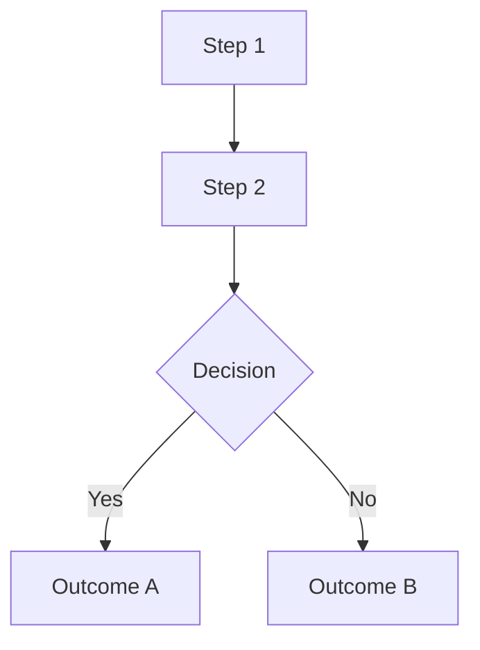
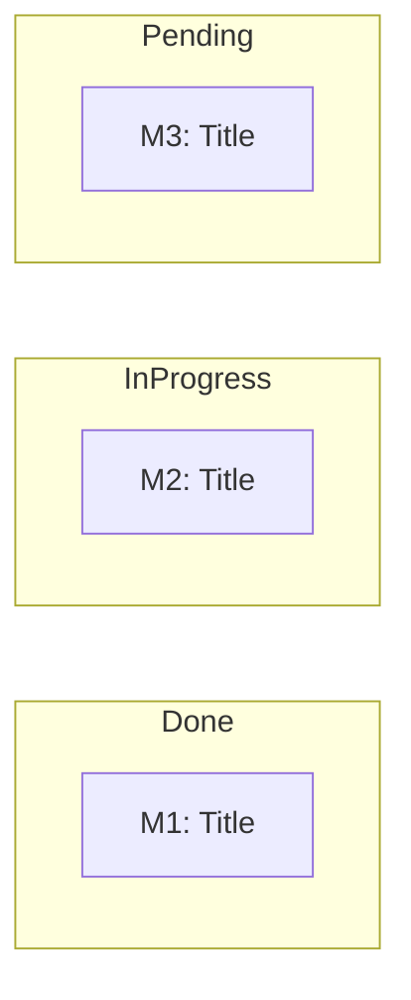
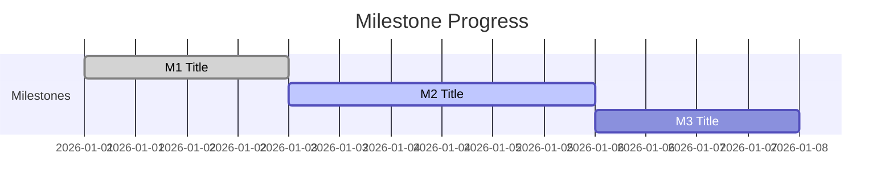

# Mermaid Patterns

Reusable snippets for lightweight inline diagrams (markdown output only — use draw.io for formal documents).

## Process flow

```mermaid
flowchart TD
    A[Step 1] --> B[Step 2]
    B --> C{Decision}
    C -->|Yes| D[Outcome A]
    C -->|No| E[Outcome B]
```

## Milestone kanban

```mermaid
flowchart LR
    subgraph Done
        M1["M1: Title"]
    end
    subgraph InProgress
        M2["M2: Title"]
    end
    subgraph Pending
        M3["M3: Title"]
    end
```

## Milestone timeline

```mermaid
gantt
    title Milestone Progress
    dateFormat  YYYY-MM-DD
    section Milestones
    M1 Title :done, m1, 2026-01-01, 2d
    M2 Title :active, m2, 2026-01-03, 3d
    M3 Title :m3, after m2, 2d
```
